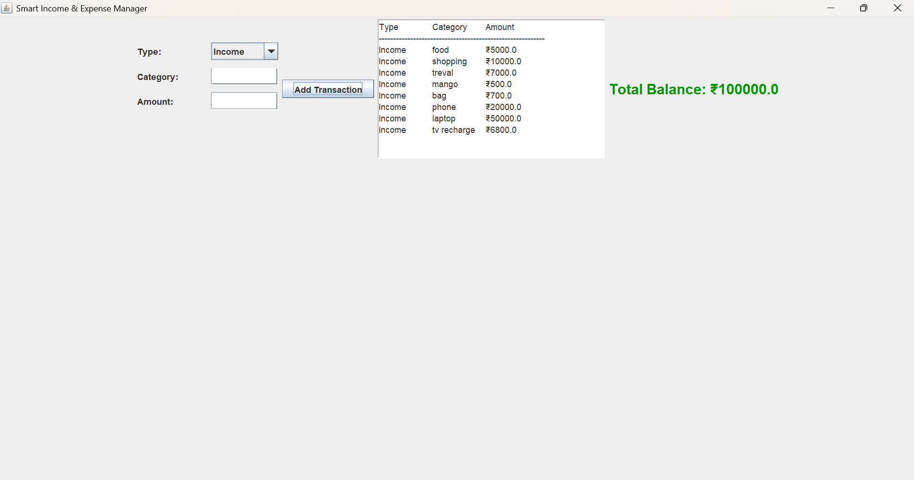

# Finance Manager System

This is a **Java-based Desktop Application** designed to help users manage their personal finances, track transactions, and maintain a record of their expenses and income.

## 👤 Student Details
* **Name:** [Ashwini kadam]
* **Roll Number:** [SA107]
* **Branch:** [Computer Engineering]
* **Name:** [Ritika Ghuge]
* **Roll Number:** [SA136]
* **Branch:** [Computer Engineering]

## 🚀 Features
* **User Interface:** Built using Java Swing/AWT for a clean GUI.
* **Database Integration:** Connects to a database (MySQL) to store financial records securely.
* **Transaction Tracking:** Add, view, and manage daily financial transactions.
* 
## 🖼️ Project Screenshots

## 🛠️ Technologies Used
* **Language:** Java
* **GUI Library:** Java Swing / AWT
* **Database:** MySQL (JDBC)

## 📁 File Structure
* `Main.java`: The entry point of the application.
* `FinanceGUI.java`: Handles the visual components and user interaction.
* `FinanceManager.java`: Contains the core logic for financial calculations.
* `DBConnection.java`: Manages the connection between the app and the database.
* `Transaction.java`: Data model for individual transactions.

## ⚙️ How to Run
1. Clone this repository.
2. Ensure you have **Java JDK** installed.
3. Configure your MySQL database settings in `DBConnection.java`.
4. Run `Main.java` to start the application.
